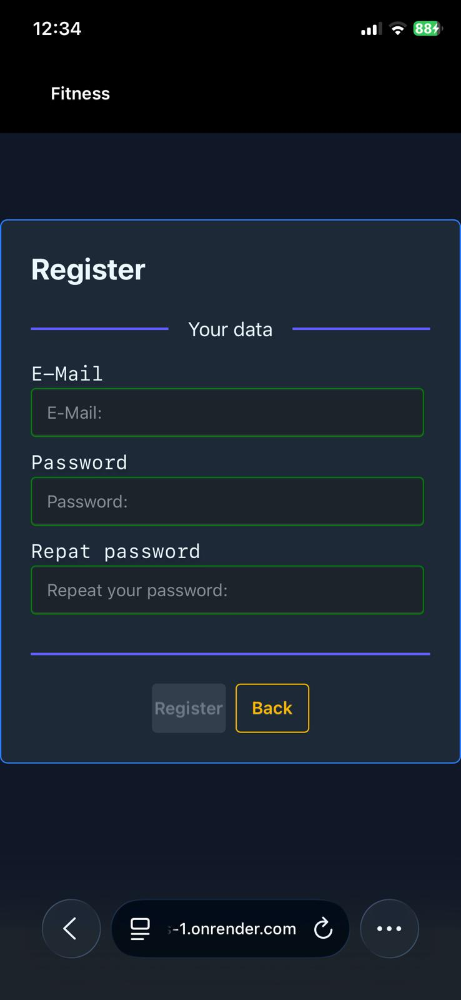
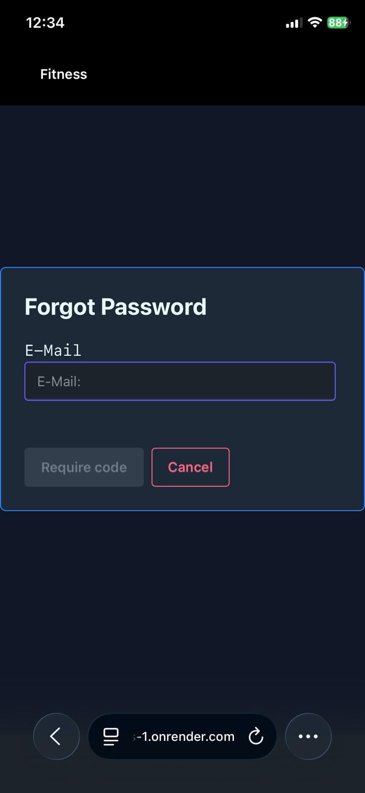
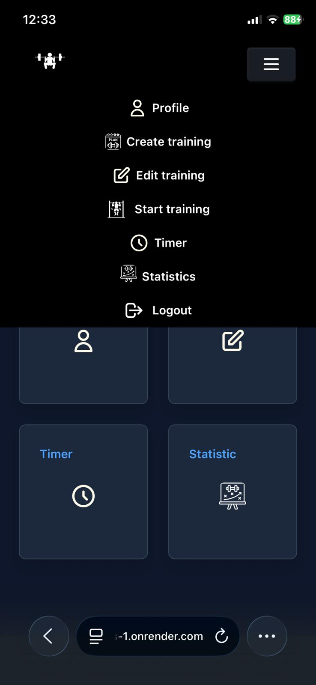
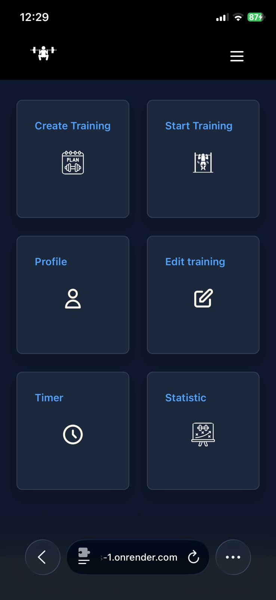
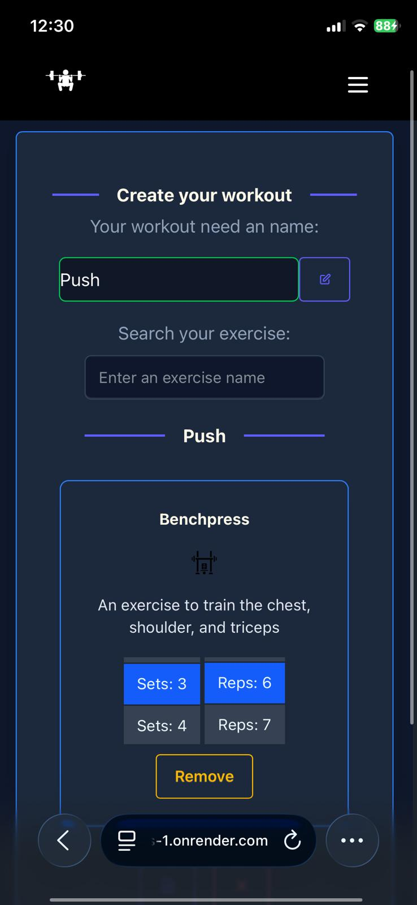
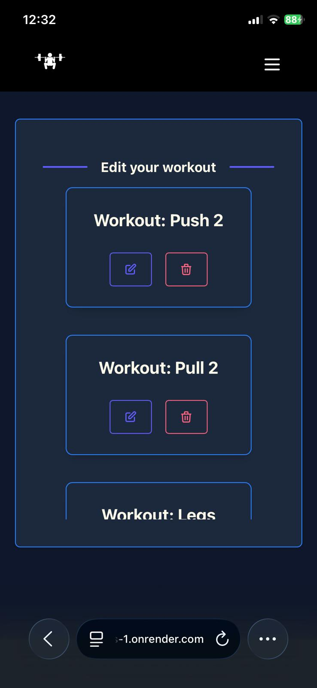
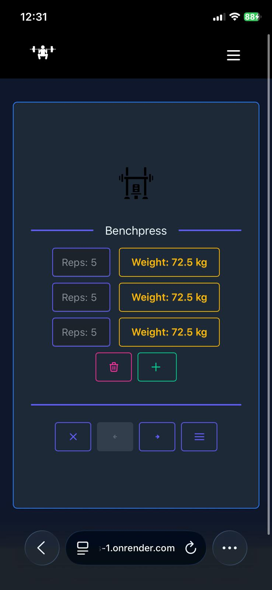
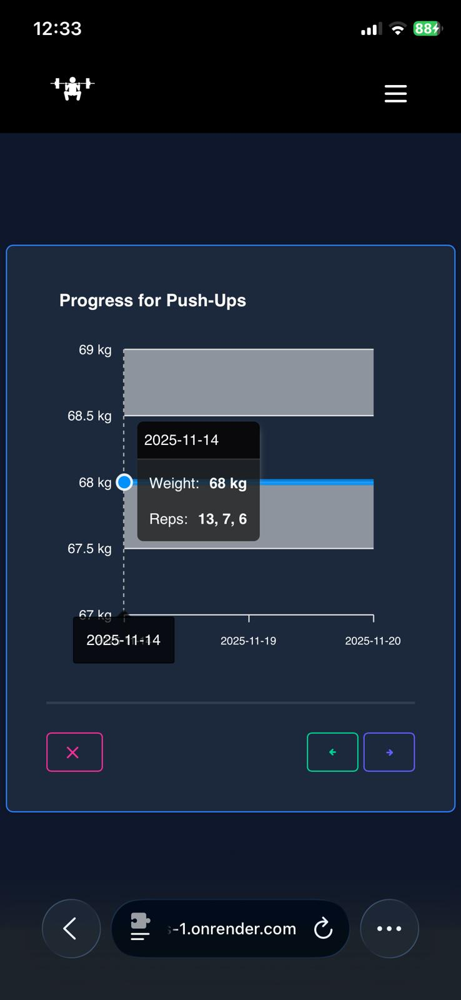
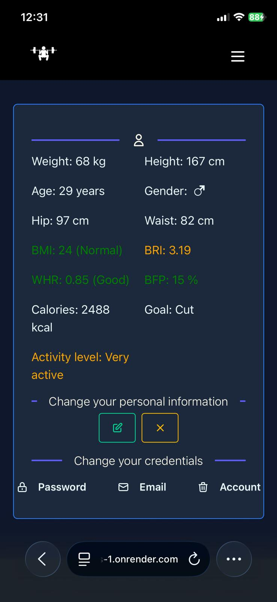
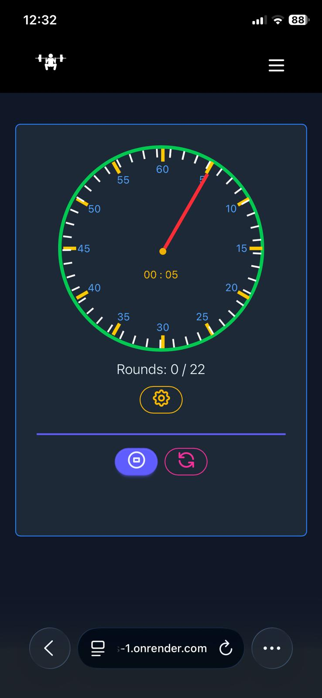

# Web-Application-Fitness

This project is part of my application for a Full-Stack Developer position. It is a fitness-focused web application that allows users to create personalized workout plans, track progress, and manage their fitness goals.

Link to live demo:

https://frontend.web-fitness-app.de

Please use following credentials:

Email: gast@gast.de

Password: q!w7w'nF9Gb+d_j

---

## 🚀 Tech Stack

- **Frontend:** React, Tailwind CSS
- **Backend:** Flask (Python)
- **Database:** PostgreSQL
- **Caching / Queues:** Redis
- **Authentication:** HTTP Secure Cookies, JWT
- **Architecture:** RESTful API

---

## 🔐 Authentication & Account Management

### 📝 Register

- Create an account with your email
- Password must meet security requirements (minimum length, uppercase/lowercase, number, special character)

### 🔑 Login

- Log in with your registered email and password
- Secure authentication using JWT + HttpOnly Secure Cookies

### 🔓 Logout

- Logout to protect against unauthorized access
- JWT is invalidated and stored in Redis with a TTL until expiration

### ❓ Forgot Password

- Request a password reset via email
- Secure token-based reset process

### 📧 Change Email

- Update your account email after password confirmation

### 🔒 Change Password

- Change your password through the account settings
- Requires current password for verification

### 🗑️ Delete Account

- Permanently delete your account and all associated data
- Requries current password for verification

---

## 📋 Features

### 🏋️ Workout Management

- Create and edit custom workout plans
- Add exercises, sets, repetitions, and weights
- Track exercise performance over time

### 👤 User Profile & Calculations

- User profile with body measurements
- Automatic calculation of calorie needs
- BMI and basic fitness metrics

### 📈 Progress Tracking

- Log exercise and training data
- View improvements and historical performance

### 🕒 Training Tools

- Integrated stopwatch for round-based and interval training

---

## 🔒 Security Highlights

- Secure authentication using JWT + HttpOnly Secure Cookies
- A JWT contains the following security-relevant claims:
- `sub` (user ID),
- `iss` (issuer),
- `aud` (audience),
- `exp` (expiration),
- `iat` (issued at),
- `nbf` (not before),
- `jti` (JWT ID).
- The backend application validates these claims to ensure the authenticity and integrity of each JWT.
- Password hashing (argon2) with salting
- Route protection to protect the UI
- Clear separation of frontend and backend using a RESTful API

---

## 🧱 Architecture

- Modular backend with Flask
- Redis caching
- PostgreSQL as a relational database
- Clean React component structure styled with Tailwind CSS

---

## 📱 PWA (Progressive Web App)

- You can install the web application on your smartphone (iPhone) for a native app-like experience.
- Simply open the app in your mobile browser and use "Add to Home Screen" to save it.
- An internet connection is required to save and retrieve data from the backend.

## Deployment

- Render via CI/CD Github
- Frontend and Backend
- Set up Custom DNS to point to web-fitness-application

---

## Docker

- The application runs in multiple Docker containers: frontend, backend, Redis, and PostgreSQL database.
- Separate Dockerfiles are provided for both frontend and backend services.
- Docker Compose orchestrates and connects all containers, enabling setup and management of the entire stack.

---

## Usage

- Bulid a docker compose container
- Do you need an env file like the example
- docker-compose up --build
- Please set up a test user once the Docker build is complete.

**Example `.env` file:**

```env
SECRET_KEY=dein-geheimer-schluessel
JWT_ALGORITHM=HS256
FLASK_ENV=development
DATABASE_URL=postgresql+psycopg2://web_fitness_app_user:mysecretpassword@db:5432/web_fitness_app
REDIS_HOST=redis://redis:6379/0
ALLOWED_ORIGINS=http://localhost:5173
JWT_AUDIENCE=user
JWT_ISSUER=fitness_app
SMTP_USER=
SMTP_PASSWORD=
VITE_API_URL=http://localhost:5001/api
```

---

## Screenshots (Mobile Devices iPhone 11 Pro)

<table>
  <tr>
    <td></td>
    <td></td>
     <td></td>
      
  </tr>
  <tr>
   <td></td>
    <td></td>
  </tr>
  <tr>
    <td></td>
    <td></td>
    <td></td>
   
  </tr>
  <tr>
   <td></td>
    <td></td>
    <td></td>
  </tr>
</table>

## Icon Attributions

- Icons from www.flaticon.com

<a href="https://www.flaticon.com/free-icons/pull-ups" title="pull ups icons">Pull ups icons created by gravisio - Flaticon</a>

<a href="https://www.flaticon.com/free-icons/bench-press" title="bench press icons">Bench press icons created by PIXARTIST - Flaticon</a>

<a href="https://www.flaticon.com/free-icons/barbell" title="barbell icons">Barbell icons created by Leremy - Flaticon</a>

<a href="https://www.flaticon.com/free-icons/incline-hammer-curl" title="incline hammer curl icons">Incline hammer curl icons created by Leremy - Flaticon</a>

<a href="https://www.flaticon.com/free-icons/exercise" title="exercise icons">Exercise icons created by Pixel perfect - Flaticon</a>

<a href="https://www.flaticon.com/free-icons/ab-crunch-machine" title="ab crunch machine icons">Ab crunch machine icons created by Leremy - Flaticon</a>

<a href="https://www.flaticon.com/free-icons/deadlift" title="deadlift icons">Deadlift icons created by Leremy - Flaticon</a>

<a href="https://www.flaticon.com/free-icons/workout" title="workout icons">Workout icons created by Leremy - Flaticon</a>

<a href="https://www.flaticon.com/free-icons/standing-dumbbell-triceps-extension" title="standing dumbbell triceps extension icons">Standing dumbbell triceps extension icons created by Leremy - Flaticon</a>

<a href="https://www.flaticon.com/free-icons/dumbbell-incline-row" title="dumbbell incline row icons">Dumbbell incline row icons created by Leremy - Flaticon</a>

<a href="https://www.flaticon.com/free-icons/incline-barbell-bench-press" title="incline barbell bench press icons">Incline barbell bench press icons created by Leremy - Flaticon</a>

<a href="https://www.flaticon.com/free-icons/kettlebell" title="kettlebell icons">Kettlebell icons created by gravisio - Flaticon</a>

<a href="https://www.flaticon.com/free-icons/leg-curl" title="leg curl icons">Leg curl icons created by faizgrafis - Flaticon</a>

<a href="https://www.flaticon.com/free-icons/leg-press" title="leg press icons">Leg press icons created by Leremy - Flaticon</a>

<a href="https://www.flaticon.com/free-icons/workout" title="workout icons">Workout icons created by Smashicons - Flaticon</a>

<a href="https://www.flaticon.com/free-icons/plank" title="plank icons">Plank icons created by Freepik - Flaticon</a>

<a href="https://www.flaticon.com/free-icons/pushup" title="pushup icons">Pushup icons created by Freepik - Flaticon</a>

<a href="https://www.flaticon.com/free-icons/sit-up" title="sit up icons">Sit up icons created by surang - Flaticon</a>

<a href="https://www.flaticon.com/free-icons/gym" title="gym icons">Gym icons created by Leremy - Flaticon</a>

<a href="https://www.flaticon.com/free-icons/leverage-shoulder-press" title="leverage shoulder press icons">Leverage shoulder press icons created by Leremy - Flaticon</a>

<a href="https://www.flaticon.com/free-icons/workout" title="workout icons">Workout icons created by Leremy - Flaticon</a>

<a href="https://www.flaticon.com/free-icons/workout" title="workout icons">Workout icons created by juicy_fish - Flaticon</a>

<a href="https://www.flaticon.com/free-icons/triceps-pushdown" title="triceps pushdown icons">Triceps pushdown icons created by Leremy - Flaticon</a>

<a href="https://www.flaticon.com/free-icons/standing-barbell-calf-raise" title="standing barbell calf raise icons">Standing barbell calf raise icons created by Leremy - Flaticon</a>

<a href="https://www.flaticon.com/free-icons/barbell-glute-bridge" title="barbell glute bridge icons">Barbell glute bridge icons created by Leremy - Flaticon</a>
